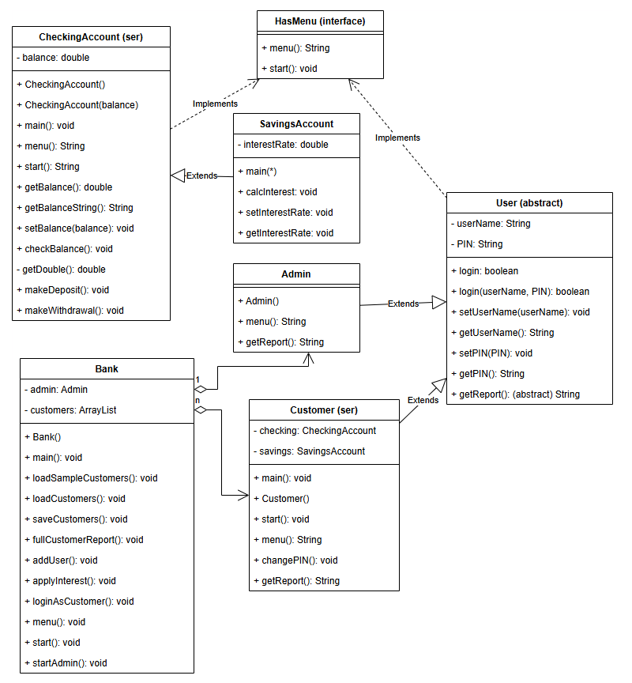

# Documentation 

## UML diagram




## Milestones for this week:
### Milestone one:
- build the Admin class
- It is arguably one of the easiest classes in the system
- It will extend User, so the login functionality is already written
- The constructor should set default username and pin values
- For ease of testing, please use "admin" as the userName and "0000" as the PIN
- Create the admin menu, which should have options to exit, make a customer report, add a user, and apply interest rates
- You need to have a start() method, but leave it blank (!!!) we'll actually do all the admin actions in the bank class.
- You need a getReport() method, but we don't really use it. Maybe have it report the admin name and PIN.

### Milestone two:
- get the basic version of the bank up and running
- It should implement HasMenu, so it will need start() and menu() methods
- The bank has two instance variables
  * a single instance of Admin
  * an ArrayList of Customers (better, a class that extends an ArrayList of Customers)
- Create a menu() method, which is the main menu of the Bank
- Create a start() method, which handles the Bank main menu inputs
- For now, print outputs indicating you got to each of the appropriate places

### Milestone three:
- Once that is tested, start implementing details
- The admin menu is most easily handled in the Bank class
- Add an adminStart() method to the Bank class
  * It will call the admin menu and handle the resulting tasks
  * Since all admin tasks are actually bank tasks, it's easier to manage them in the bank.
  * At first, just use print statements to confirm user's intentions
  * When you are ready to test, have the bank main menu try to login the admin, and if the login is successful, run the adminStart() method
- Add the ability to login as a customer
  * This should be a method in the Bank class
  * Ask for a userName and PIN
  * Set an instance of Customer (currentCustomer, perhaps) to null
  * Go through every customer in the customerList
   - if you can log in to that customer
    * set currentCustomer to that customer
    * activate the start() method of that customer
  * If you get through the entire list without a successful login, inform the user
- Add admin methods to Bank class
  * The admin menu will need a few methods. None of them are difficult, but you'll need them:
  * fullCustomerReport()
   - step through each customer in the list
   - print the getReport() value from that customer
  * addUser()
   - Ask user for a userName and a PIN
   - Create customer with that information
   - add that customer to the end of the customer list
  * applyInterest()
   - Go through each customer in the list
   - apply the calcInterest() method of the savings account for that customer

### Milestone four:
- Create a saveCustomers() method in Bank
- Create a loadCustomers() method in Bank
- Modify the Bank constructor to save and load the data
  * On your first pass, create and save the default data for testing purposes
  * After initial save is tested, comment out these lines, but you may want to keep them around for retesting
- Test everything to make sure it's all working


## Make File with testing commands (Old Make File)
```
Customer.class: Customer.java User.class CheckingAccount.class SavingsAccount.class
 javac -g Customer.java

User.class: User.java HasMenu.class
 javac -g User.java

CheckingAccount.class: CheckingAccount.java HasMenu.class
 javac -g CheckingAccount.java

SavingsAccount.class: SavingsAccount.java CheckingAccount.class
 javac -g SavingsAccount.java

HasMenu.class: HasMenu.java
 javac -g HasMenu.java

testAdmin: Admin.class
 java Admin

testCustomer: Customer.class
 java Customer

testChecking: CheckingAccount.class
 java CheckingAccount

testSavings: SavingsAccount.class
 java SavingsAccount

clean:
 rm *.class
```

